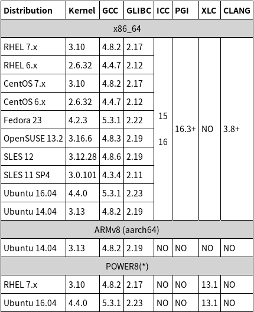

# Install the CUDA and cuDNN on ubuntu 16.06 LTS

## Disabling Nouveau driver from machine

+ remove the nouveau kernel driver
  ```bash
  sudo apt-get remove nvidia* && sudo apt autoremove
  sudo apt-get install dkms build-essential linux-headers-generic
  ```
+ add the below on /etc/modprobe.d/blacklist.conf
  ```bash
  sudo vi /etc/modprobe.d/blacklist.conf
  ```
    > blacklist nouveau</br>
    > blacklist lbm-nouveau</br>
    > options nouveau modeset=0</br>
    > alias nouveau off</br>
    > alias lbm-nouveau off</br>
  ```bash
  echo options nouveau modeset=0 | sudo tee -a /etc/modprobe.d/nouveau-kms.conf
  sudo update-initramfs -u
  sudo reboot
  ```
+ check the stable python version
  ```bash
  (python2.7)
  echo "import sys;print(sys.version_info);" | python

  (python3.6)
  echo "import sys;print(sys.version_info);" | python3

  (if not, updating python 3.5 to 3.6)
  sudo add-apt-repository ppa:jonathonf/python-3.6
  sudo apt-get update
  sudo apt-get install python3.6
  ```

## Install nvidia graphic driver

> it is based on geforce 840M

```bash
wget http://us.download.nvidia.com/XFree86/Linux-x86_64/384.90/NVIDIA-Linux-x86_64-384.90.run
sudo service lightdm stop
chmod 755 NVIDIA-Linux-x86_64-384.90.run
./NVIDIA-Linux-x86_64-384.90.run
```

## Install CUDA driver

+ [Check GPUs](https://developer.nvidia.com/cuda-gpus)
+ Requirements</br>
  ```bash
  (check kernel)
  uname -a | awk '{print $3}'
  (check gcc)
  gcc --version | head -1
  (check glibc)
  getconf -a | grep libc
  ```
+ Download Proper version [CUDA Toolkit 8.0](https://developer.nvidia.com/cuda-80-ga2-download-archive)
> it is based on cuda_8.0.61_375.26_linux-run

```bash
(base)
wget -O cuda-repo-ubuntu1604-8-0-local-ga2_8.0.61-1_amd64.deb https://developer.nvidia.com/compute/cuda/8.0/Prod2/local_installers/cuda-repo-ubuntu1604-8-0-local-ga2_8.0.61-1_amd64-deb
(patch)
wget https://developer.nvidia.com/compute/cuda/8.0/Prod2/patches/2/cuda-repo-ubuntu1604-8-0-local-cublas-performance-update_8.0.61-1_amd64-deb
sudo apt-key add /var/cuda-repo-8-0-local-ga2/7fa2af80.pub
sudo apt-get update --fix-missing
sudo apt-get install cuda cuda-cublas-8-0 cuda-cublas-dev-8-0 nvidia-cuda-toolkit
sudo rm -rf /etc/apt/sources.list.d/*.list
```

+ Activate the cuda library

```bash
sudo ldconfig

# on your account
cat >> ~/.bashrc << EOF
export PATH=$PATH:/usr/local/cuda-8.0
export LD_LIBRARY_PATH=$LD_LIBRARY_PATH:/usr/local/cuda-8.0/lib64
EOF
. ~/.bashrc
```

+ verify CUDA toolkit

```bash
sudo cp -r /usr/local/cuda/sample (your folder)/
```

+ if you have unsupport gcc version

```bash
sudo apt-get install gcc-6 g++-6
sudo ln -s /usr/bin/gcc-6 /usr/local/cuda/bin/gcc
sudo ln -s /usr/bin/g++-6 /usr/local/cuda/bin/g++
cd ~/NVIDIA_CUDA-8.0_Samples
make clean&&make
cd 1_Utilities/deviceQueryDrv/
./deviceQueryDrv
```

## Install cuDNN

+ Requirements
  + A GPU of **compute capability 3.0 or higher**
  + One of the following supported platforms: **Ubuntu 14.04**, **Ubuntu 16.04**, POWER8
  + One of the following supported CUDA versions and NVIDIA graphics driver: NVIDIA graphics **driver 375.74 or newer for CUDA 8**, NVIDIA graphics **driver 384.66 or newer for CUDA 9 RC**
+ Download cuDNN from [site](https://developer.nvidia.com/rdp/cudnn-download)
> need to register and log in

```bash
sudo dpkg -i libcudnn7_7.0.3.11-1+cuda8.0_amd64.deb
sudo dpkg -i libcudnn7-dev_7.0.3.11-1+cuda8.0_amd64.deb
sudo dpkg -i libcudnn7-doc_7.0.3.11-1+cuda8.0_amd64.deb
```

+ verify cuDNN

```bash
cp -r /usr/src/cudnn_samples_v7/ $HOME
cd  $HOME/cudnn_samples_v7/mnistCUDNN
make clean && make
./mnistCUDNN

(check below message)
Test passed!!
```
