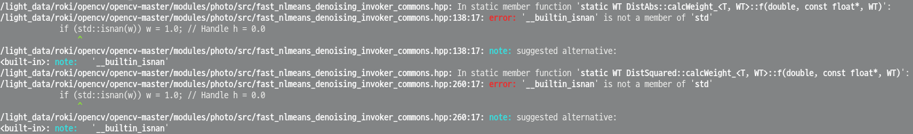

Install OpenCV gpu version
==========================
> this is based on OpenCV 3.1.0
>
# prerequite
```bash
# gstreamer1.0
sudo apt-get install libgstreamer1.0-0 gstreamer1.0-plugins-base gstreamer1.0-plugins-good gstreamer1.0-plugins-bad gstreamer1.0-plugins-ugly gstreamer1.0-libav gstreamer1.0-doc gstreamer1.0-tools

sudo apt-get install --assume-yes build-essential cmake git pkg-config unzip ffmpeg qtbase5-dev python-dev python3-dev python-numpy python3-numpy
sudo apt-get install --assume-yes libhdf5-dev libgtk-3-dev libdc1394-22 libdc1394-22-dev libjpeg-dev libpng-dev libtiff5-dev
sudo apt-get install --assume-yes libavcodec-dev libavformat-dev libswscale-dev libxine2-dev

echo "deb http://us.archive.ubuntu.com/ubuntu/ yakkety universe" | sudo tee -a /etc/apt/sources.list
sudo apt-get update
sudo apt-get install --assume-yes libjasper-dev

wget http://ftp.kr.debian.org/debian/pool/main/g/gstreamer0.10/libgstreamer0.10-0_0.10.36-1.5_amd64.deb
wget http://ftp.kr.debian.org/debian/pool/main/g/gst-plugins-base0.10/libgstreamer-plugins-base0.10-0_0.10.36-2_amd64.deb
sudo gdebi libgstreamer0.10-0_0.10.36-1.5_amd64.deb
sudo gdebi libgstreamer-plugins-base0.10-0_0.10.36-2_amd64.deb

sudo apt-get install --assume-yes libv4l-dev libtbb-dev libfaac-dev libmp3lame-dev libopencore-amrnb-dev libopencore-amrwb-dev libtheora-dev
sudo apt-get install --assume-yes libvorbis-dev libxvidcore-dev v4l-utils libgphoto2-dev
sudo apt-get install --assume-yes python-vtk6

git clone https://github.com/daveselinger/opencv.git
git checkout 3.1.0-with-cuda8
wget -O opencv_contrib_3.1.0.zip https://github.com/opencv/opencv_contrib/archive/3.1.0.zip
pip2 install numpy
pip3 install numpy
```
# cmake build options
```bash
cd $OPENCV_SOURCE_DIR
mkdir BUILD
cd build
mkvirtualenv -p python2.7 opencv
pip install numpy

cmake -D CMAKE_BUILD_TYPE=RELEASE \
-D CMAKE_INSTALL_PREFIX=/usr/local \
-D CMAKE_C_COMPILER=/usr/bin/gcc-5 \
-D CMAKE_CXX_COMPILER=/usr/bin/g++-5 \
-D OPENCV_EXTRA_MODULES_PATH=/images/opencv_contrib-3.1.0/modules \
-D WITH_CUDA=ON \
-D WITH_CUBLAS=ON \
-D CUDA_FAST_MATH=1 \
-D ENABLE_FAST_MATH=1 \
-D CUDA_GENERATION=Auto \
-D WITH_TBB=ON \
-D WITH_V4L=ON \
-D WITH_QT=ON \
-D WITH_OPENGL=ON \
-D BUILD_PERF_TESTS=OFF \
-D BUILD_TESTS=OFF \
-D CUDA_NVCC_FLAGS="-D_FORCE_INLINES" ..

make -j20 # insert proper # of cpu core
sudo make Install
sudo ldconfig
```
> when you got the below message in compiling
> </br>
> </br>try to to edit the below lines
  ```bash
  --- /usr/include/x86_64-linux-gnu/c++/5/bits/c++config.h.bak	2017-11-07 00:53:02.751217575 +0100
  +++ /usr/include/x86_64-linux-gnu/c++/5/bits/c++config.h	2017-11-07 01:31:04.506126867 +0100
  @@ -1343,7 +1343,7 @@

   /* Define if C99 functions or macros in <math.h> should be imported in <cmath>
      in namespace std. */
  -/* #undef _GLIBCXX_USE_C99_MATH */
  +#define _GLIBCXX_USE_C99_MATH 1
  ```


# Link to your virtualenv
```bash
# python2
ln -s /usr/local/lib/python2.7/site-packages/cv2.so $VIRTUAL_ENV/lib/python2.7/site-packages/cv2.so

# python3
ln -s /usr/local/lib/python3.6/site-packages/cv2.so $VIRTUAL_ENV/lib/python3.6/site-packages/cv2.so
```
