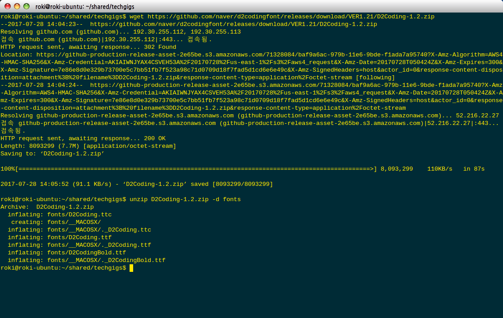
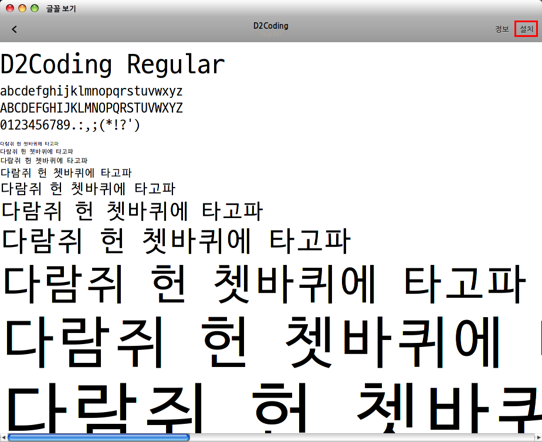

# Installing Ubuntu server 17.10

## Get ubuntu server 17.10

+ Download the image from website
+ (In terminal)

```bash
wget http://releases.ubuntu.com/17.10/ubuntu-17.10-server-amd64.iso?_ga=2.151642809.1825931799.1508921890-1585575442.1508921890
```

+ Use **rufus** program make iso to usb disk

## Configure the network through netplan

+ netplan is a new front-end for network front-end
+ netplan uses cfg files in /etc/netplan
> example</br>
> &emsp;network:</br>
> &emsp;version: 2</br>
> &emsp;renderer: networkd</br>
> &emsp;ethernets:</br>
> &emsp;&emsp;enp2s0:</br>
> &emsp;&emsp;addresses: [ xxx.xxx.xxx.xxx/24 ]&emsp;## CIDR expression</br>
> &emsp;&emsp;gateway4: xxx.xxx.xxx.xxx</br>
> &emsp;&emsp;nameservers:</br>
> &emsp;&emsp;&emsp;addresses: [xxx.xxx.xxx.xxx, xxx.xxx.xxx.xxx]</br>

+ (In terminal)

```bash
(Generate backend specific configuration files from /etc/netplan/*.yaml)
netplan generate

(Apply current netplan config to running system)
netplan apply

(Try to convert /etc/network/interfaces to netplan. If successful, disable /etc/network/interfaces.)
netplan ifupdown-migrate
```

+ Handling the interfaces

```bash
ip link set ${device name} up
ip link set ${device name} down
```

+ Change nautilus configuration for convenience
  + Download the font file from [this link](https:/github.com/naver/d2codingfont "D2codingfont")

  ```bash
  wget https://github.com/naver/d2codingfont/releases/download/VER1.21/D2Coding-1.2.zip
  unzip D2Coding-1.2.zip -d fonts
  ```

  
  > for explanation [What should use D2codingfont?](https://m.blog.naver.com/PostView.nhn?blogId=eominsuk55&logNo=220696227935&proxyReferer=https%3A%2F%2Fwww.google.co.kr%2F)

  + Install the fonts

  ```bash
  cd fonts
  sudo gnome-font-viewer D2Coding.ttc
  ```

  
  > press install button on the upper-right corner
  + Configure as default font in terminal
    + nautilus -> Edit -> Profile Preferences -> general -> choose **D2Coding font, size 12**
    + nautilus -> Edit -> Profile Preferences -> general -> choose **Terminal size 140 by 40**
    + nautilus -> Edit -> Profile Preferences -> colors -> choose **Use transparent background**
  + Configure custom shorcut
    + (on system keyboard shortcut configure) [Keyboard] -> [Custom Shortcuts] -> [+] -> {'Name':'force stop current', 'Command': setxkbmap -option terminate:ctrl_alt_bksp} -> set __*ctrl+alt+bksp*__
    + (on system keyboard shortcut configure) [Keyboard] -> [Custom Shortcuts] -> [+] -> {'Name':'process monitor', 'Command': gnome-system-monitor} -> set __*Super+Delete*__

## Change locale on ubuntu server

+ Check the locale and install language pack

```bash
sudo localectl
sudo apt-get -y install language-pack-ko-base language-pack-ko
sudo localectl set-locale LANG=ko_KR.UTF-8 LANGUAGE="ko_KR:ko"
sudo localectl
```

## Install the Hangul

+ Install ibus-hangul package

```bash
sudo apt-get install ibus-hangul
```

+ Add the input source on the system setting
+ system setting -> Region & Language -> Input Sources -> '+' -> select 'Korean' -> 'Korean (Hangul)'
+ **'Super'** -> 'Ibus Hangul Perference'